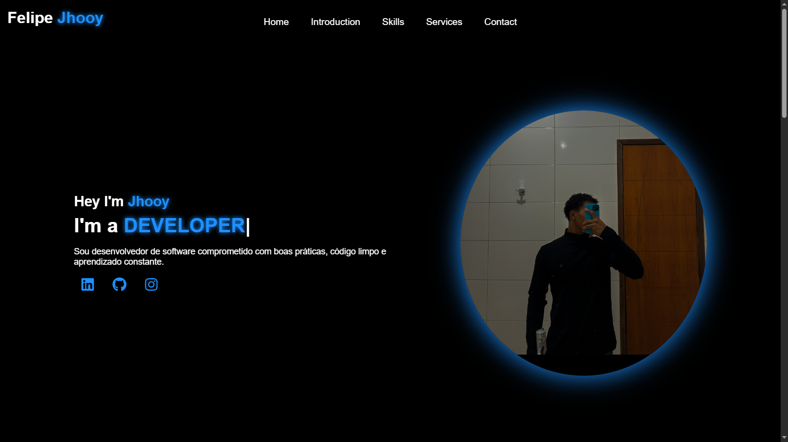

# 🌐 Meu Portfólio

Bem-vindo ao meu portfólio! 🚀  
Aqui você encontra meus projetos, habilidades e informações de contato.

---

## 🖼️ Preview do Site


---

## 👨‍💻 Sobre Mim
Sou estudante com 3 anos de formação no IFMA, no curso de Informática, onde adquiri conhecimentos em:
- Desenvolvimento de software
- Redes de computadores
- Manutenção de sistemas

Tenho experiência prática em programação, análise de sistemas e suporte técnico.  
Busco oportunidades para crescer como desenvolvedor e aplicar meus conhecimentos em projetos reais.

---

## 🛠️ Tecnologias Utilizadas

<p align="left">
  
  
  
  
  
</p>

---

## 🎯 Objetivo do Projeto
Desenvolver um portfólio moderno e responsivo para:
- Mostrar minhas habilidades
- Apresentar meus projetos
- Facilitar o contato com recrutadores e parceiros

---

## 🌎 Acesse o Portfólio
🔗 [**Clique aqui para visitar meu portfólio**](https://jho0oy.github.io/Portifolio/)

---

## 📬 Contato
<p align="left">
  <a href="https://www.linkedin.com/in/felipe-silva-b195b6383/"></a>
  <a href="https://github.com/Jho0oy"></a>
  <a href="mailto:jhooydev@gmail.com"></a>
</p>

---

## 📌 Como Rodar o Projeto Localmente
Se quiser testar na sua máquina, siga os passos:

```bash
# Clone o repositório
git clone https://github.com/Jho0oy/Portifolio.git

# Entre na pasta do projeto
cd Portifolio

# Abra o arquivo index.html no navegador
